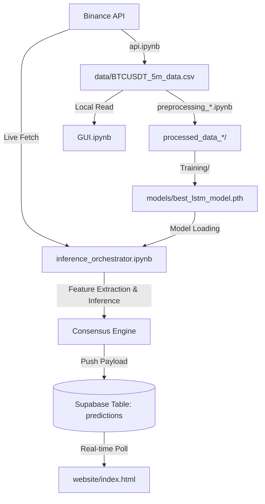

# Crypto AI Prediction Project Context

Welcome! This document provides a complete technical context of the **Binance Bitcoin/Crypto Prediction Project** for Gemini and other AI agents working on this codebase.

---

## 📌 Project Overview & Goals
The main objective of this project is to build a full machine-learning pipeline that predicts future cryptocurrency prices (starting with Bitcoin, but also structured for Ethereum and Ripple) using 5-minute candlestick data. 
The pipeline consists of:
1. **Data Collection**: Fetching historical candlestick (kline) data from the Binance API.
2. **Preprocessing & Scaling**: Parsing, cleaning, technical feature engineering, scaling, and sequence window generation.
3. **Model Training**: PyTorch-based sequential models (stacked LSTM) and attention-based models (Temporal Fusion Transformer - TFT) trained to predict future Bollinger Band %B values.
4. **Live Inference Orchestration**: An engine that periodically fetches live data, runs inferences from model checkpoints, determines a prediction consensus, and pushes payloads to Supabase.
5. **Dashboards**: 
   - A local interactive Python GUI using `plotly` and `ipywidgets`.
   - A real-time web-based trading dashboard using HTML/CSS, Vanilla JS, Chart.js, and the Supabase API.

---

## 🏗️ Architecture & Data Flow



---

## 📁 Repository Directory Structure

Below is the directory map of the workspace:

```
c:/Users/Lenovo/Documents/CryptoProject/
├── .venv/                          # Python Virtual Environment
├── Preprocessing/                  # Feature engineering & sequence generation
│   ├── Preprocessing LSTM/         # Preprocessing for LSTM (BTC, ETH, XRP)
│   └── Preprocessing Transformer/  # Preprocessing for Transformer/TFT (BTC, ETH, XRP)
├── Training/                       # PyTorch model definition & training
│   ├── Training LSTM/              # Stacked LSTM trainers (BTC, ETH, XRP)
│   └── Training Transformer/       # TFT/Transformer trainers (BTC, ETH, XRP)
├── data/                           # Historical OHLCV datasets
│   └── BTCUSDT_5m_data.csv         # ~128MB dataset of 5m candles (2017 - present)
├── models/                         # Saved PyTorch state dict checkpoints (.pth)
│   └── best_lstm_model.pth         # Stacked LSTM weights
├── website/                        # Live Web Dashboard
│   └── index.html                  # Supabase + Chart.js frontend
├── README.md                       # High-level project README
├── GUI.ipynb                       # Local plotly/ipywidgets prediction viewer
├── api.ipynb                       # BinanceDataLoader class (fetches historical data)
└── inference_orchestrator.ipynb    # Live inference engine pushing to Supabase
```

---

## 🧼 Data Engineering & Preprocessing

### 1. Data Collection (`api.ipynb`)
- Class: `BinanceDataLoader`
- Symbol options: `BTCUSDT`, `ETHUSDT`, `XRPUSDT`
- Timeframe: `5m` (5-minute candles)
- Range: `2017-09-09` to present, fetched in paginated chunks of 1000 candles with rate-limit protections.
- Outputs saved to: `data/{SYMBOL}_{INTERVAL}_data.csv`.

### 2. Preprocessing & Features (`Preprocessing/`)
The preprocessors perform data cleaning (removing duplicate candles, sorting, forward-filling nulls) and engineer **14 technical indicators**:
- **Log Returns**: `log_ret = ln(close_t / close_{t-1})`
- **Momentum Indicators**: RSI (Relative Strength Index), RSI change over 3 steps, RSI acceleration over 2 steps.
- **Trend Indicators**: MACD, MACD slope, Moving Average Distance (distance from 20-candle MA), ADX (Average Directional Index).
- **Volatility**: Bollinger Band `%B` value change, Bollinger Bands upper/lower bands.
- **Volume**: Log-scaled Volume, Volume Z-Score, Volume Spike indicator.
- **Time Cyclic Encoding**: Hour sine and cosine encodings to help models recognize intraday periodic behaviors.

### 3. Window & Target Generation
- **Sequence Length**: `120` steps (representing the past 10 hours of trading).
- **Prediction Target**: Future smoothed Bollinger Band `%B` value shifted `3 steps ahead` (predicting 15 minutes into the future).
  - Target value represents where the price will stand relative to the Bollinger Bands (1.0 = Upper Band, 0.0 = Lower Band, 0.5 = Middle SMA).
- **Train/Val/Test Splits**: Chronological splits (usually 80% train, 10% val, 10% test).
- **Scaler**: `StandardScaler` fitted strictly on training feature sets.
- Outputs: Saved as `.npy` array files inside `processed_data_lstm/` or `processed_data_transformer/`.

---

## 🧠 Model Architectures & Training (`Training/`)

### 1. Stacked LSTM (`Training LSTM/`)
- **Architecture**:
  - Input layer: matches features (14 features).
  - Stacked LSTM layers (typically 2 layers, 128 hidden units, dropout 0.1).
  - Fully connected regression head (predicting 1 continuous output).
- **Loss Function**: Directional Log-Cosh Loss (penalizes error magnitude and wrong directional movement).
- **Optimizations**: AdamW optimizer, ReduceLROnPlateau scheduler.

### 2. Temporal Fusion Transformer (`Training Transformer/`)
- **Architecture**:
  - Variable Selection Network (VSN): Dynamically weights the importance of each of the 14 features at every timestep.
  - Gated Residual Network (GRN) & Gated Linear Units (GLU) for information filtering.
  - Positional Encoding.
  - Transformer Encoder: Captures long-range dependencies in sequence windows.
  - Fully connected regression head.
- **Loss Function**: Huber Loss (robust to noise and outliers in high-frequency financial series).

---

## 🚀 Live Inference & Orchestration (`inference_orchestrator.ipynb`)

Designed to run continuously (e.g., in a Google Colab GPU instance or locally), this notebook coordinates live prediction cycles:
1. **Initialization**:
   - Authenticates and loads Supabase credentials from `supabase_creds.json`.
   - Recreates model structures and loads weights (expects `models/best_lstm_model.pth` and `models/best_tft_vsn.pth`).
   - Fits scalers on the historical dataset to ensure consistency with training time.
2. **Main loop (Runs every 5 minutes)**:
   - Fetches the latest 1000 candles from Binance.
   - Computes features on the most recent window.
   - Performs scaling and forward-pass inference for both models.
   - **Consensus Engine**: Compares predicted percentage changes (`LSTM` vs `Transformer`). It chooses the model showing the higher expected deviation (more active signal) as `chosen_model`.
   - **Database Push**: Updates the Supabase `predictions` table (`id: 1` payload) containing the current price, predictions, expected percentage change, signal classification (`LONG`/`SHORT`/`NEUTRAL`), and downsampled historical metrics.

---

## 📊 Dashboard Visualizations

### 1. local Dashboard (`GUI.ipynb`)
- Local notebook UI built using `ipywidgets` and `plotly.graph_objects`.
- Reads locally generated prediction dumps (`lstm_dashboard_data.csv` or `transformer_dashboard_data.csv`).
- Renders an interactive Plotly Candlestick chart overlaid with a dashed line of predictions, metric cards, and trading signals.

### 2. Live Web Client (`website/index.html`)
- Tech Stack: HTML5, Dark-themed CSS, Vanilla JavaScript, Chart.js, Supabase Client JS.
- Functionality:
  - Connects to Supabase Database.
  - Polls `predictions` table every 30 seconds.
  - Classifies signal:
    - `LONG` 🟢 (change_pct > +0.1%)
    - `SHORT` 🔴 (change_pct < -0.1%)
    - `NEUTRAL` ⚪ (otherwise)
  - Renders a horizontal scrollable time-series chart showing historical price action, LSTM prediction history (dashed yellow), Transformer prediction history (dashed magenta), and the **NEXT** projected price point.
  - Supports 5m, 1h, and 1d chart resolution switches.

---

## ⚠️ Notes & Caveats for Future Agents
1. **Missing Transformer Checkpoint**: The `models/` folder currently only contains `best_lstm_model.pth`. The `best_tft_vsn.pth` is missing in the workspace. If you need to debug or test the orchestrator with the Transformer model active, you will first need to run the `transformer_trainer_BTC.ipynb` notebook to train and save the weights.
2. **Supabase Connections**: The database URL and credentials are tied to a specific Supabase instance (`https://iphxmjltsigsaocicipu.supabase.co`). Ensure credentials in `supabase_creds.json` remain secure.
3. **Bollinger Band Price Reconstruction**: Because the model predicts Bollinger Band `%B` value rather than the raw price, the predicted price is reconstructed as:
   $$\text{Predicted Price} = \text{Lower Band} + (\text{Prediction} \times (\text{Upper Band} - \text{Lower Band}))$$
   Make sure you always reconstruct the price using the bands computed on the *inference* window.
